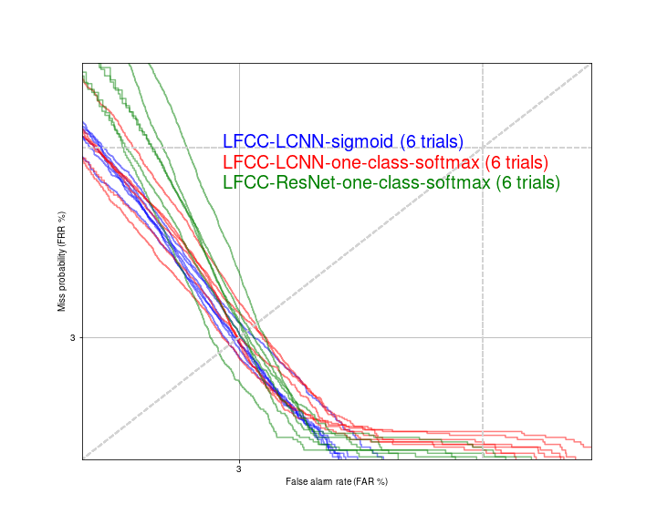
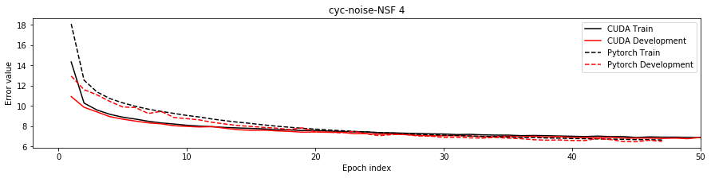

# project-NII-pytorch-scripts
By Xin Wang, National Institute of Informatics, 2020

I am a new pytorch user. If you have any suggestions or questions, pleas email wangxin at nii dot ac dot jp

------
## 1. Update

* 2020-11: Default Pytorch is updated to 1.6
* 2020-11: Projects on speech anti-spoofing [./project/02-asvspoof](./project/02-asvspoof)
* 2020-08: Tutorial materials are added to [./tutorials](./tutorials). Most of the materials are Jupyter notebooks and can be run on your Laptop using CPU. 

## 2. Overview
This repository hosts pytorch codes for a few projects:

### 2.1 Neural waveform model [./project/01-nsf](./project/01-nsf)

1. [Cyclic-noise neural source-filter waveform model (NSF)](https://nii-yamagishilab.github.io/samples-nsf/nsf-v4.html)

2. [Harmonic-plus-noise NSF with trainable sinc filter](https://nii-yamagishilab.github.io/samples-nsf/nsf-v3.html) 

3. [Harmonic-plus-noise NSF with fixed FIR filter](https://nii-yamagishilab.github.io/samples-nsf/nsf-v2.html) 

All NSF projects come with pre-trained models on CMU-arctic (4 speakers) and a one-click demo script to run, train, do inference.

Generated samples from pre-trained models can be found in ./project/01-nsf/\*/__pre_trained/output.

Note that this is the re-implementation of projects based on [CURRENNT](https://github.com/nii-yamagishilab/project-CURRENNT-public). All the papers published so far used CURRENNT implementation. Many samples can be found on [NSF homepage](https://nii-yamagishilab.github.io/samples-nsf/).

### 2.2 Speech anti-spoofing [./project/02-asvspoof](./project/02-asvspoof)
1. Baseline LFCC + LCNN-binary-classifier (lfcc-lcnn-sigmoid)
2. LFCC + LCNN + angular softmax (lfcc-lcnn-a-softmax)
3. LFCC + LCNN + one-class softmax (lfcc-lcnn-ocsoftmax)
4. LFCC + ResNet18 + one-class softmax (lfcc-restnet-ocsoftmax)

On ASVspoof2019 LA, EER is around 3%, and min-tDCF (legacy-version) is around 0.06~0.08. I trained each system for 6 times on various GPU devices (single V100 or P100 card), each time with a different random initial seed. Figure below shows the DET curves for these systems:


As you can see how the results vary a lot when simply changing the initial random seends. Even with the same random seed, Pytorch environment, and [deterministic algorithm selected](https://pytorch.org/docs/stable/notes/randomness.html), the trained model may be different due to the CUDA and GPU. It is encouraged to run the model multiple times with different random seeds and show the variance of the evaluation results.

For LCNN, please check (Lavrentyeva 2019); for LFCC, please check (Sahidullah 2015); for one-class softmax in ASVspoof, please check (Zhang 2020).

## 3. Python environment

Only a few packages are required:
1. python 3 (test on python3.8) 
2. Pytorch 1.6 and above (test on pytorch-1.6)
3. numpy (test on  1.18.1)
4. scipy (test on 1.4.1)
5. torchaudio (test on 0.6.0)
6. librosa (0.8.0) with numba (0.48.0) and mir_eval (0.6) for some music projects 

I use miniconda to manage python environment. You may use [./env.yml](./env.yml) or [./env2.yml](./env2.yml) to create the environment on our server by: 

```
# create environment
$: conda env create -f env.yml
# load environment (whose name is pytorch-1.6)
$: conda activate pytorch-1.6
```

## 4. Usage
Take cyc-noise-nsf as an example:

```
# Load python environment
$: conda activate pytorch-1.6

# cd into one project
$: cd project/01-nsf/cyc-noise-nsf-4

# add PYTHONPATH and activate conda environment
$: source ../../../env.sh 

# run the script
$: bash 00_demo.sh
``` 

The printed info will tell you what is happening. The script may need 1 day or more to finish.

You may also put the job to background rather than waiting for the job while keeping the terminal open:

```
# run the script in background
$: bash 00_demo.sh > log_batch 2>&1 &
``` 

The above steps will download the CMU-arctic data, run waveform generation using a pre-trained model, and train a new model (which may take 1 day or more on Nvidia V100 GPU). 


## 5. Notes 

### 5.1 On NSF projects (./project/01-nsf)
* Input data: 00_demo.sh above will download a data package for the CMU-arctic corpus, including wav (normalized), f0, and Mel-spectrogram. If you want to train the model on your own data, please prepare the input/output data by yourself. There are scripts to extract features from 16kHz in the CMU-arctic data package (in ./project/DATA after running 00_demo.sh)

* Batch size: implementation works only for batchsize = 1. My previous experiments only used batchsize = 1. I haven't update the data I/O to load varied length utterances

* To 24kHz: most of my experiments are done on 16 kHz waveforms. If you want to try 24 kHz waveforms, FIR or sinc digital filters in the model may be changed for better performance:
    
    1. in hn-nsf: lp_v, lp_u, hp_v, and hp_u are calculated on for 16 kHz configurations. For different sampling rate, you may use this online tool http://t-filter.engineerjs.com to get the filter coefficients. In this case, the stop-band for lp_v and lp_u is extended to 12k, while the pass-band for hp_v and hp_u is extended to 12k. The reason is that, no matter what is the sampling rate, the actual formats (in Hz) and spectral of sounds don't change along the sampling rate;

    2. in hn-sinc-nsf and cyc-noise-nsf: for the similar reason above, the cut-off-frequency value (0, 1) should be adjusted. I will try (hidden_feat * 0.2 + uv * 0.4 + 0.3) * 16 / 24 in model.CondModuleHnSincNSF.get_cut_f();


### 5.2 Project organization and design

Here are some details on the data format and project file structure:

#### Data format

* Waveform: 16/32-bit PCM or 32-bit float WAV that can be read by [scipy.io.wavfile.read](https://docs.scipy.org/doc/scipy/reference/generated/scipy.io.wavfile.read.html) 

* Other data: binary, float-32bit, litten endian ([numpy dtype <f4](https://numpy.org/doc/1.18/reference/generated/numpy.dtype.html)). The data can be read in python by:
```
# for a data of shape [N, M]
>>> f = open(filepath,'rb')
>>> datatype = np.dtype(('<f4',(M,)))
>>> data = np.fromfile(f,dtype=datatype)
>>> f.close()
```
I assume data should be stored in [c_continuous format](https://numpy.org/doc/stable/reference/generated/numpy.ndarray.flags.html) (row-major). 
There are helper functions in ./core_scripts/data_io/io_tools.py to read and write binary data:
```
# create a float32 data array
>>> import numpy as np
>>> data = np.asarray(np.random.randn(5, 3), dtype=np.float32)
# write to './temp.bin' and read it as data2
>>> import core_scripts.data_io.io_tools as readwrite
>>> readwrite.f_write_raw_mat(data, './temp.bin')
>>> data2 = readwrite.f_read_raw_mat('./temp.bin', 3)
>>> data - data2
# result should 0
```

#### Files

Directory | Function
------------ | -------------
./core_scripts | scripts to manage the training process, data io, and so on
./core_modules | finished pytorch modules 
./sandbox | new functions and modules to be test
./project | project directories, and each folder correspond to one model for one dataset
./project/\*/\*/main.py | script to load data and run training and inference
./project/\*/\*/model.py | model definition based on Pytorch APIs
./project/\*/\*/config.py | configurations for training/val/test set data

The motivation is to separate the training and inference process, the model definition, and the data configuration. For example:

* To define a new model, change model.py only
* To run on a new database, change config.py only

### 5.3 Differences from CURRENNT NSF implementation
There may be more, but here are the important ones:

* "Batch-normalization": in CURRENNT, "batch-normalization" is conducted along the length sequence, i.e., assuming each frame as one sample. There is no equivalent implementation on this Pytorch repository;

* No bias in CNN and FF: due to the 1st point, NSF in this repository uses bias=false for CNN and feedforward layers in neural filter blocks, which can be helpful to make the hidden signals around 0;

* smaller learning rate: due to the 1st point, learning rate in this repository is decreased from 0.0003 to a smaller value. Accordingly, more training epochs;

* STFT framing/padding: in CURRENNT, the first frame starts from the 1st step of a signal; in this Pytorch repository (as Librosa), the first frame is centered around the 1st step of a signal, and the frame is padded with 0;

* (minor one) STFT backward: in CURRENNT, STFT backward follows the steps in [this paper](https://ieeexplore.ieee.org/document/8915761/); in Pytorch repository, backward over STFT is done by the Pytorch library. 

* ...

The learning curves look similar to the CURRENNT (cuda) version.


## Reference

1. Xin Wang and Junichi Yamagishi. 2019. Neural Harmonic-plus-Noise Waveform Model with Trainable Maximum Voice Frequency for Text-to-Speech Synthesis. In Proc. SSW, pages 1–6, ISCA, September. ISCA. http://www.isca-speech.org/archive/SSW_2019/abstracts/SSW10_O_1-1.html

2. Xin Wang, Shinji Takaki, and Junichi Yamagishi. 2020. Neural source-filter waveform models for statistical parametric speech synthesis. IEEE/ACM Transactions on Audio, Speech, and Language Processing, 28:402–415. https://ieeexplore.ieee.org/document/8915761/

3. Xin Wang, Junichi Yamagishi. 2020. Using Cyclic-noise as source for Neural source-filter waveform model. Accepted, Interspeech

4. Galina Lavrentyeva, Sergey Novoselov, Andzhukaev Tseren, Marina Volkova, Artem Gorlanov, and Alexandr Kozlov. 2019. STC Antispoofing Systems for the ASVspoof2019 Challenge. In Proc. Interspeech, 1033–1037.

5. You Zhang, Fei Jiang, and Zhiyao Duan. 2020. One-Class Learning towards Generalized Voice Spoofing Detection. ArXiv Preprint ArXiv:2010.13995.

6. Md Sahidullah, Tomi Kinnunen, and Cemal Hanilçi. 2015. A Comparison of Features for Synthetic Speech Detection. In Proc. Interspeech, 2087–2091.