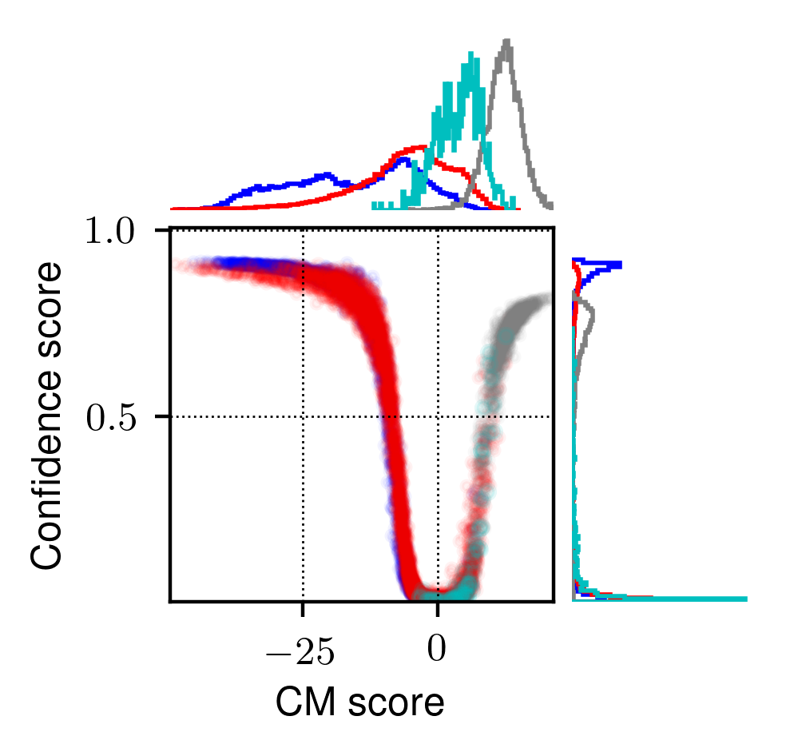

# SSL-based front-end for spoofing countermeasure




This project estimates the confidence of speech spoofing countermeasures. 

Arxiv link: [https://arxiv.org/abs/2110.04775](https://arxiv.org/abs/2110.04775)

```
Xin Wang, and Junichi Yamagishi. Estimating the Confidence of Speech Spoofing Countermeasure. In Proc. ICASSP, 6372–6376. 2022.

@inproceedings{Wang2021,
archivePrefix = {arXiv},
arxivId = {2110.04775},
author = {Wang, Xin and Yamagishi, Junichi},
booktitle = {Proc. ICASSP},
eprint = {2110.04775},
pages = {6372--6376},
title = {{Estimating the confidence of speech spoofing countermeasure}},
year = {2022}
}

```
 
This project requires non-standard data sets. Apologize that the code is dirty. 


## How-to

### step.1 prepare the ASVspoof data

1. Download [ASVspoof 2019 LA](https://doi.org/10.7488/ds/2555) and convert FLAC to WAV
2. Put eval set waves to ./DATA/asvspoof2019_LA/eval
3. Put train and dev sets to ./DATA/asvspoof2019_LA/train_dev
4. Make sure that the two folders contain the waveform files: 
```sh
   $: ls DATA/asvspoof2019_LA/eval 
   LA_E_1000147.wav
   LA_E_1000273.wav
   LA_E_1000791.wav
   LA_E_1000841.wav
   LA_E_1000989.wav
   ...
   $: ls DATA/asvspoof2019_LA/eval | wc -l
   71237

   $: ls DATA/asvspoof2019_LA/train_dev
   LA_D_1000265.wav
   LA_D_1000752.wav
   LA_D_1001095.wav
   LA_D_1002130.wav
   LA_D_1002200.wav
   LA_D_1002318.wav
   ...

   $: ls DATA/asvspoof2019_LA/train_dev | wc -l
   50224
```

### step.2 Run demonstration script   
```sh
bash 00_demo.sh PATH_TO_PROJECT
```
where `PATH_TO_PROJECT` can be:
```sh
AM-softmax-conf/config_train_asvspoof2019    
AM-softmax-maxprob/config_train_asvspoof2019
AM-softmax-energy/config_train_asvspoof2019
Softmax-conf/config_train_asvspoof2019         
Softmax-energy/config_train_asvspoof2019       
Softmax-maxprob/config_train_asvspoof2019
Softmax-energy/config_train_asvspoof2019_esp
```

This demo.sh will 
1. install conda environment if it is not ready
2. download pre-trained models, and additional datasets (espnet, vcc)
3. scoring the test sets using pre-trained models
4. train a new model
6. scoring the test sets using the newly trained model
  
Softmax-energy/config_train_asvspoof2019_bc10 can be run after manually downloading the BC data. See Note 1 below.

### step.3 Get metric
Get evaluation metrics using [02_metrics.ipynb](02_metrics.ipynb)
This is a Jupyter notebook.
Please check it on github website.


## Folder structure
Files marked with = are generated after running 00_demo.sh.

```sh
|- DATA: data folder 
|  |= asvspoof2019_LA
|  |  |= protocol.txt: 
|  |  |   protocol file
|  |  |   this will be loaded by pytorch code for training and evaluation
|  |  |= scp: 
|  |  |   list of files for traing, dev, and eval sets
|  |  |= train_dev: 
|  |  |   waveform for train and dev sets   
|  |  |= eval: 
|  |  |   waveform for eval sets   
|  |
|  |= bc_release (folder for Blizzard Challenge, same structure as asvspoof2019_LA)
|  |= espnet_release (folder for ESPnet data, same structure as asvspoof2019_LA)
|  |= vcc_release  (folder for VCC data, same structure as asvspoof2019_LA)
|
|- 00_demo.sh: demo script
|- 01_conda.sh: script to install conda environment
|- 01_eval.sh: script that will be used for scoring the test set
|- 01_train.sh: script that will be used for training a model
|
|- config_train_asvspoof2019.py: configuration to use training set of ASVspoof2019 LA
|- config_train_asvspoof2019_esp.py: configuration to use training set of ASVspoof2019+ESPNet
|- config_train_asvspoof2019_bc10.py: configuration to use training set of ASVspoof2019+BC
|- config_test_asvspoof2019.py: configuration for test set ASVspoof2019 LA
|- config_test_vcc.py: configuration for test set VCC 
|- main.py: main.py that will be used by each model for training/scoring
|
|- Softmax-energy: project for model using softmax and energy estimator
|  |- config_train_asvspoof2019 (systems trained using config_train_asvspoof2019.py)
|  |  |- 01 (running using the first random seed)
|  |  |  |- model.py: model definition, Pytorch code
|  |  |  |= 01_train.sh: script copied from the root
|  |  |  |= 01_eval.sh:  script copied from the root
|  |  |  |= main.py:     main.py copied from the root
|  |  |  |= config_*.py: configuration files copied from the root
|  |  |  |= __pretrained
|  |  |  | |= trained_network.pt: pre-trained model by Xin
|  |  |  |
|  |  |  |= trained_network.pt: trained model after the full training process
|  |  |  |= *.dic: 
|  |  |  |   cache files to save the duration information of each trial
|  |  |  |   they are automatically generated by the code
|  |  |  |   they can be deleted freely
|  |  |  |= log_train.txt: training log
|  |  |  |= log_train_err.txt: error log (it also contains the training loss of each trial)
|  |  |  |= log_gen_err.txt: error log during scoring
|  |  |  |= log_output_*.txt: evaluation log
|  |  |  |= log_output_pretrained_*_score.txt: score of each trial, using pre-trained models
|  |  |  |= log_output_trained_*_score.txt: score of each trial, using newly trained models
|  | 
|  |- config_train_asvspoof2019_espnet (systems trained using config_train_asvspoof2019_esp.py)
|  |  | ...
|
|- ...
```

log_train_*.txt is self-explanable.

log_eval_*_score.txt has five columns (see Note 2):
  File name, label, score, confidence
  LA_E_1066571, 1, 19.160793, 20.1

## Note
1. Blizzard data must be downloaded manually by each user, due to license. Thus, please do not try Softmax-energy/config_train_asvspoof2019_bc10 first. Please try other models first. After that, please check README in DATA/bc_release

2. If GPU memory is insufficient, please reduce `--batch-size` in `01_train.sh`

3. Output score is in text format:

   ```
   File name, label, score, confidence
   LA_E_1066571, 1, 19.160793, 20.1
   ```

    If the label of a trial is given in the protocol file, the label will be: 

    ```
    0, which denotes spoof
    1, which denotes bona fide
    ```

    If the label of a trial is not given in the protocol file, the label will be:
    ```
    -1, which means unknown (not provided)
    ```
    
4. Accordingly, the code assumes 0 and 1 as the tables for spoof and bona fide
   trials, respectively.   
5. main.py and config.py in this project are slightly different from those in 02_asvspoof, 03_asvspoof_mega, 04_asvspoof_toy. Thus, don't mix main.py and config.py from different projects.

6. Not all the models are here due to the messy scripts (e.g., that in M-distance)
   
7. For a high-level explanation of how the functions and objects work in the script, please check `../../README.md`

---
That's all