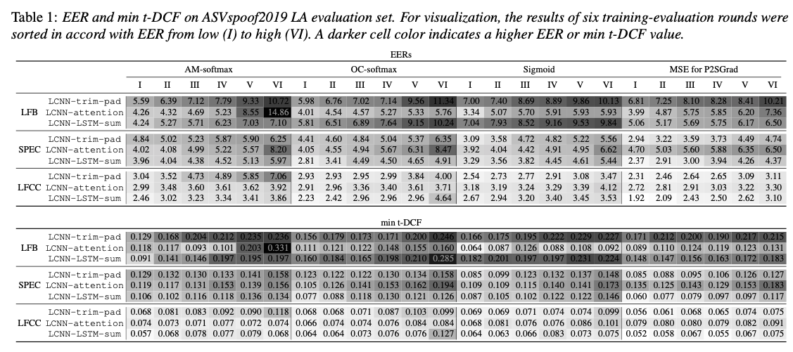
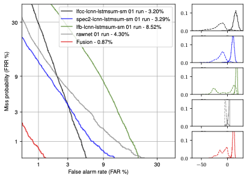
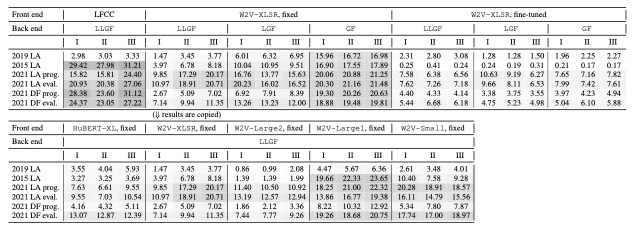

# Welcome

This repository hosts the following projects:


## [01-nsf](./01-nsf) Neural source-filter waveform model 


Projects for neural source-filter waveform models.

* All the projects include a pre-trained model and a one-click demo script. 

* Tutorial on NSF models is available in [../tutorials/b1_neural_vocoder](../tutorials/b1_neural_vocoder).

* Note that the tutorial **chapter_a3_pretrained_vocoders.ipynb** includes pre-trained NSF models on VoxCeleb2 dev and other speech datasets [](https://colab.research.google.com/drive/1xObWejhqcdSxFAjfWI7sudwPPMoCx-vA?usp=sharing).

```bibtex
Xin Wang, Shinji Takaki, and Junichi Yamagishi. Neural Source-Filter Waveform Models for Statistical Parametric Speech Synthesis. IEEE/ACM Transactions on Audio, Speech, and Language Processing 28: 402–415. doi:10.1109/TASLP.2019.2956145. 2020.

Xin Wang, Shinji Takaki, and Junichi Yamagishi. Neural Source-Filter-Based Waveform Model for Statistical Parametric Speech Synthesis. In Proc. ICASSP, 5916–5920. IEEE. doi:10.1109/ICASSP.2019.8682298. 2019.

Xin Wang, and Junichi Yamagishi. Neural Harmonic-plus-Noise Waveform Model with Trainable Maximum Voice Frequency for Text-to-Speech Synthesis. In Proc. SSW, 1–6. ISCA: ISCA. doi:10.21437/SSW.2019-1. 2019.

Xin Wang, and Junichi Yamagishi. Using Cyclic Noise as the Source Signal for Neural Source-Filter-Based Speech Waveform Model. In Proc. Interspeech, 1992–1996. ISCA: ISCA. doi:10.21437/Interspeech.2020-1018. 2020.
```


## [05-nn-vocoders](./05-nn-vocoders) Neural waveform models 

Projects for other waveform models, including WaveNet vocoder, WaveGlow, Blow, and iLPCNet.

* All the projects include a pre-trained model and a one-click demo script. 

* Tutorial on NSF models is also available in [./tutorials/b1_neural_vocoder](./tutorials/b1_neural_vocoder).

* Note that the tutorial **chapter_a3_pretrained_vocoders.ipynb** includes pre-trained HiFiGAN and WaveGlow models on VoxCeleb2 dev and other speech datasets [](https://colab.research.google.com/drive/1xObWejhqcdSxFAjfWI7sudwPPMoCx-vA?usp=sharing).

## [03-asvspoof-mega](./03-asvspoof-mega) Spoofing countermeasures on ASVspoof 2019 LA 





Project to compare 36 models, 6 runs per system.

* Pre-trained models, scores, training recipes are all available. 

* For statistical analysis, please check the tutorial notebook in [./tutorials/b2_anti_spoofing](../tutorials/b2_anti_spoofing/chapter_a1_stats_test.ipynb)


```
Xin Wang, and Junichi Yamagishi. A Comparative Study on Recent Neural Spoofing Countermeasures for Synthetic Speech Detection. In Proc. Interspeech, 4259–4263. doi:10.21437/Interspeech.2021-702. 2021.

Xin Wang, and Junichi Yamagishi. A Practical Guide to Logical Access Voice Presentation Attack Detection. In Frontiers in Fake Media Generation and Detection, 169–214. Springer. doi:10.1007/978-981-19-1524-6_8. 2022.
```


## [06-asvspoof-ood](./06-asvspoof-ood) Spoofing countermeasures confidence estimation 


Project to estimate confidence for speech spoofing countermeasure

```
Xin Wang, and Junichi Yamagishi. Estimating the Confidence of Speech Spoofing Countermeasure. In Proc. ICASSP, 6372–6376. 2022.
```

## [07-asvspoof-ssl](./07-asvspoof-ssl) Spoofing countermeasures using SSL-based front end 



Project to use SSL-based front end

* Pre-trained models and recipes are all available.

* Dependency, pre-trained models, and SSL models will be automatically downloaded using a simple `00_demo.sh`

```
Xin Wang, and Junichi Yamagishi. Investigating Self-Supervised Front Ends for Speech Spoofing Countermeasures. In Proc. Odyssey, 100–106. doi:10.21437/Odyssey.2022-14. 2022.
```


## [08-asvspoof-activelearn](./08-asvspoof-activelearn) Spoofing countermeasures using active learning 


Project to use active learning to train the model on a large pool data set

* Pre-trained models and recipes are all available.

* Dependency, pre-trained models, and SSL models will be automatically downloaded using a simple `00_demo.sh`

```bibtex
Xin Wang, and Junichi Yamagishi. Investigating Active-Learning-Based Training Data Selection for Speech Spoofing Countermeasure. In Proc. SLT, accepted. 2023.
```


## [09-asvspoof-vocoded-trn](./09-asvspoof-vocoded-trn) Vocoded spoofed speech data for spoofing countermeasures


This project uses vocoded spoofed data to train spoofing speech countermeasures.  Arxiv link: [https://arxiv.org/abs/2210.10570](https://arxiv.org/abs/2210.10570)

* Script is available for demonsration on a toy data set

* Vocoders used to create voc.v2, v3, and v4 in the paper are available in this Colab notebook [](https://colab.research.google.com/drive/1xObWejhqcdSxFAjfWI7sudwPPMoCx-vA?usp=sharing).  See more in README

* Links to vocoded datasets are listed in README.

```bibtex
Xin Wang, and Junichi Yamagishi. Spoofed training data for speech spoofing countermeasure can be efficiently created using neural vocoders. Proc. ICASSP, 2023, accepted
```

---
That's all